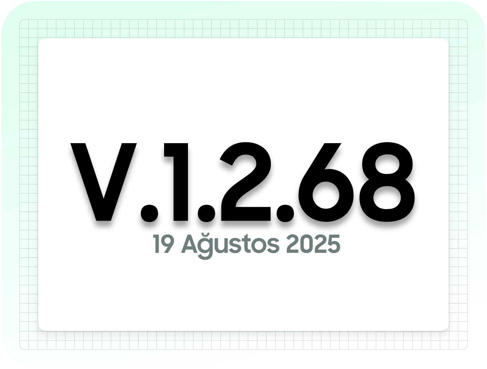

# Güncelleme Kayıtları

## V.1.2.68

&#x20;19 Ağustos 2025


{% column width="25%" %}
<figure><figcaption></figcaption></figure>


{% column width="75%" %}
Banka Hesap Hareketleri

* Banka hareket mahsup fonksiyonuna, Eğer seçilen Cari TCKN/VKN doğru değilse ve gelen hareketin TCKN/VKN doğru ise hareketteki TCKN/VKN otomatik işlenir.
* Giden Banka Hareketlerinde: Manuel “İşlendi”(Ödeme’ye bağlı değilse ve Gider Pusulasına Bağlı değilse) olarak işaretlenen kayıtlar tekrarın durumu tekrar güncellenebilir.
* Hareket detaylarında Durum bilgisi eklendi.


