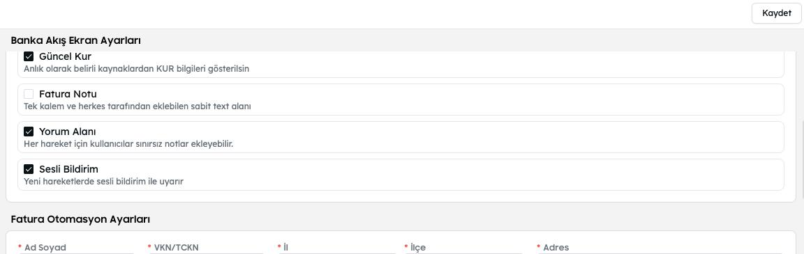

# 2.0.23

[akis.md](../app/akis.md "mention") ekranına sesli bildirim eklendi [admin](../app/admin/ "mention") ekranından ayarlanabilir.

<figure><figcaption></figcaption></figure>

Konnektör listemize [mikro-socket.md](../app/konnektor/entegrasyonlar/mikro-socket.md "mention")eklenmiştir.

[envanter](../app/envanter/ "mention") modülüne [dekont-takip.md](../app/envanter/dekont-takip.md "mention") özelliği eklenmiştir.

[kimlik-yonetimi](../app/denetim/kimlik-yonetimi/ "mention") WhatsApp ile kimlik yüklemelerde PDF veya dosya yüklenmeme durumlarında uyarı eklendi.

[kimlik-yonetimi](../app/denetim/kimlik-yonetimi/ "mention") Yapay Zeka ile kimlik işleme sürecindeki bekleme durumu geliştirildi.

